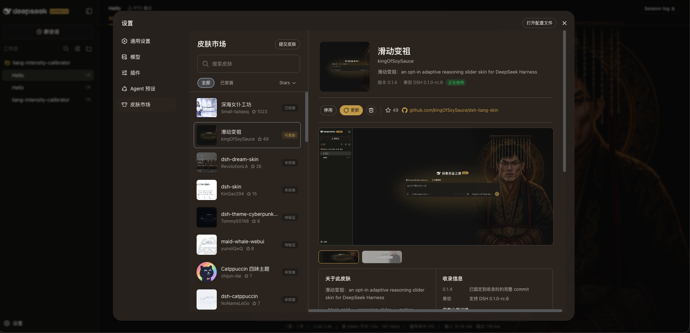
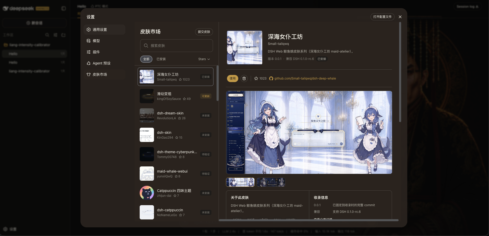

# DSH 皮肤市场

一个嵌入 DSH 设置页的皮肤市场，可以浏览、安装、使用、停用、更新和卸载社区皮肤。

把下面这句话复制给你的 Agent，就可以安装：

```text
请帮我把这个插件安装到 DSH 的 web profile：https://github.com/kingOfSoySauce/dsh-skin-market。安装完成后告诉我如何重启 DSH Web，并确认可以从“设置 → 皮肤市场”打开它。不要替我安装任何皮肤。
```

安装完成后，重启 DSH Web，打开「设置 → 皮肤市场」。

<p align="center">
  
</p>

<p align="center">
  
</p>

当前面向 DSH Web `0.1.0-rc.6`。目录中的安装目标固定到收录时的完整 commit。

## 收录你的皮肤

如果你开发了 DSH 皮肤，先准备一个公开的 GitHub 仓库，再复制下面整段提示词给你的 Agent。把 `<你的皮肤仓库地址>` 换成真实地址即可。

这不是终端命令，而是交给 Agent 的任务说明：

```text
请把我的 DSH 皮肤提交到 DSH 皮肤市场。

皮肤仓库：<你的皮肤仓库地址>
目标目录仓库：https://github.com/kingOfSoySauce/dsh-skin-market
目录路径：registry/skins

请自主完成以下工作：
1. 只用只读方式检查皮肤仓库；识别单包或 monorepo 子包，读取 package.json、DSH bundle/client 声明、cordis.patch.yml、README、许可证、真实预览图和 release/tag。
2. 确认它确实是可安装的 DSH Web 皮肤，不要仅凭仓库名、README 文案或 dsh-plugin topic 判定。
3. 解析准备收录版本对应的完整 40 位 commit SHA。安装目标必须固定到该 SHA，禁止使用 main、master、HEAD 或其他可变分支。
4. 不要猜测皮肤名、包名、rowId、许可证、兼容版本或素材授权。缺少关键信息时先列出缺项，不要创建虚假条目。
5. 预览图只选择仓库内真实截图，使用固定 commit 的 GitHub raw HTTPS 地址；不要使用 SVG、data URI、第三方图床或带追踪参数的 URL。
6. fork 或 clone 目标目录仓库并新建分支；按照 registry/skin.schema.json，在 registry/skins 下新增一个独立 YAML。不要修改无关文件，也不要覆盖已有条目。
7. 在目标目录仓库根目录运行 npm run registry 和相关测试。不得安装到我的真实 DSH profile，不得读取 .env、凭据、聊天记录或工作区外的私密文件。
8. 检查 git diff，提交变更并向目标目录仓库创建 PR。PR 标题使用“feat(registry): add <皮肤名>”，正文列出仓库、子包、版本、commit、许可证、预览来源、兼容性、自动检查结果和仍需人工确认的风险。
9. 创建 PR 后返回 PR 链接；如果没有 GitHub 权限或需要登录，只准备好分支、commit 和可复制的 PR 内容，并明确告诉我下一步。

收录不等于安全认证。不要声称该皮肤已被 DSH 官方、安全团队或市场背书。
```

皮肤市场里的「提交皮肤」也可以根据仓库地址生成这段提示词。

## 收录要求

- 必须是公开、可安装的 DSH Web 皮肤仓库或 monorepo 子包
- 安装来源必须固定到完整 40 位 commit SHA
- 必须提供明确的 package、row ID、许可证和兼容范围
- 预览图必须是仓库中的真实界面截图
- Topic、仓库名称和 Stars 只用于发现与排序，不代表安全审核或官方背书

## 本地开发

需要 Node.js 22 或更高版本。

```bash
git clone https://github.com/kingOfSoySauce/dsh-skin-market.git
cd dsh-skin-market
npm install
npm run dev
```

`npm run dev` 只启动使用 Mock Host 数据的预览页面，不会修改任何 DSH profile。

常用检查命令：

```bash
npm run registry
npm test
npm run typecheck
npm run build
```

完整的本地安装和回滚验证步骤见 [TESTING.md](./TESTING.md)。

## 目录维护

```bash
npm run crawl:smoke
npm run crawl:top-stars
npm run crawl:full-ingest
```

正式目录条目位于 `registry/skins/`，Schema 位于 `registry/skin.schema.json`。仓库的 GitHub Actions 会定期同步已收录仓库并为目录变化创建 PR。

## 安全说明

- 浏览器只能提交 registry 中的 `skinId`，不能提交任意命令或安装地址
- 安装、更新和激活失败时会恢复 profile manifest 快照并清理半安装状态
- GitHub Stars 由定时收录任务写入带更新时间的目录快照，页面和 Host 都不在浏览时请求 GitHub API
- 市场不会代替开发者登录 GitHub，也不会静默创建 PR

## License

[MIT](./LICENSE)
